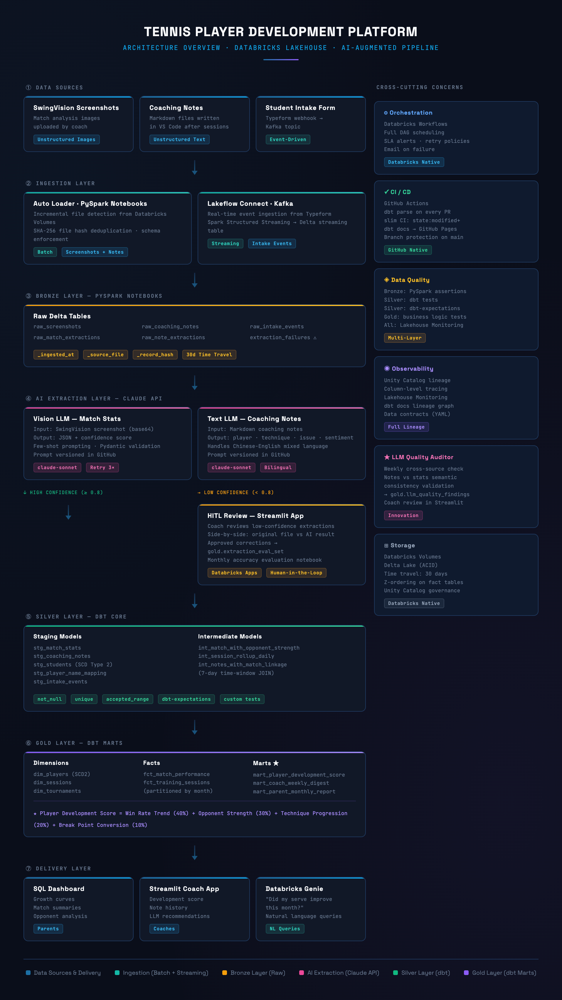

# Tennis Player Development Platform
### An AI-Augmented Analytics Engineering Project on Databricks


> **One-line pitch:** An end-to-end Lakehouse platform built by a certified tennis coach, using AI to process unstructured data sources and help coaches improve student performance through data-driven decisions.

**Target roles:** Analytics Engineer · Data Engineer · AI Engineer (data platform track)

---

## Table of Contents

1. [Project Positioning](#1-project-positioning)
2. [Tech Stack](#2-tech-stack)
3. [Architecture Overview](#3-architecture-overview)
4. [Data Sources & Ingestion Strategy](#4-data-sources--ingestion-strategy)
5. [Medallion Layer Design](#5-medallion-layer-design)
6. [AI / LLM Integration](#6-ai--llm-integration)
7. [Production Engineering Practices](#7-production-engineering-practices)
8. [Deliverables](#8-deliverables)
9. [12-Week Task Plan](#9-12-week-task-plan)
10. [Resume Bullet Points](#10-resume-bullet-points)
11. [Interview Narrative](#11-interview-narrative)

---

## 1. Project Positioning

### Five Core Selling Points

**1. Domain Expertise × Data Engineering — dual identity**
You are a real tennis coach whose students have competed at the USTA Sectional level. Every modeling decision is grounded in real coaching logic, not guesswork. In interviews you are both subject matter expert and engineer at the same time.

**2. Diverse data sources covering all ingestion patterns**
- Unstructured images (SwingVision screenshots) → Multimodal LLM extraction
- Unstructured text (coaching notes) → Text LLM structured extraction
- Structured form data (student intake questionnaire) → Lakeflow Connect event-driven streaming
- Synthetic historical data → batch loading for volume

**3. AI as a tool, not a gimmick**
LLMs solve real DE problems: unstructured-to-structured conversion, semantic validation, natural language querying. This is the AI-augmented data platform narrative that employers want in 2026.

**4. Production engineering practices**
Medallion architecture · dbt layered modeling · Auto Loader · Lakeflow Connect · data quality testing · CI/CD · orchestration · observability · lineage · human-in-the-loop review.

**5. Real stakeholder feedback**
Real student parents use the final dashboard. Their written feedback appears in this README. This is something 95% of portfolio projects do not have.

---

## 2. Tech Stack

This project runs on **Databricks Premium tier** and is built to maximize Databricks-native tooling, with VS Code as the local development environment and GitHub for all version control and CI/CD.

| Layer | Tool | Purpose |
|---|---|---|
| **IDE** | VS Code + Databricks Extension | Local development, notebook sync, Git integration |
| **Version Control** | GitHub | All code, dbt models, prompts, notebooks |
| **Storage & Compute** | Databricks (Premium) | Core Lakehouse platform |
| **Tables** | Delta Lake (built-in) | ACID transactions, time travel, CDC |
| **File Storage** | Databricks Volumes | Raw files: screenshots, markdown notes, CSVs |
| **Batch Ingestion** | Auto Loader + PySpark notebooks | Incremental file ingestion from Volumes |
| **Streaming Ingestion** | Databricks Lakeflow Connect + Kafka | Real event-driven ingestion from Typeform webhook |
| **Transformation** | dbt Core + dbt-databricks | Silver & Gold layer modeling |
| **AI / LLM** | Claude API (claude-sonnet) | Extract structured stats from screenshots & notes |
| **Data Quality** | dbt tests + dbt-expectations (Silver/Gold) · custom PySpark checks (Bronze) | Multi-layer quality gates |
| **CI/CD** | GitHub Actions | Auto lint + dbt build on every PR |
| **Orchestration** | Databricks Workflows | Full DAG scheduling with SLA alerts |
| **HITL Review** | Streamlit hosted on Databricks Apps | Human review of low-confidence AI extractions |
| **Coach Dashboard** | Streamlit hosted on Databricks Apps | Student development view for coaches |
| **BI / Parent View** | Databricks SQL Dashboards | Monthly progress dashboard for parents |
| **NL Queries** | Databricks Genie | Natural language querying on Gold layer |
| **Observability** | Databricks Lakehouse Monitoring | Data quality drift, freshness, volume anomalies |
| **Lineage** | Unity Catalog (column-level lineage) | End-to-end data lineage |

### Why This Stack?

Every tool above is either **Databricks-native**, **GitHub-native**, or the **industry-standard open-source tool** (dbt) that works across every major cloud warehouse. There is no throwaway tool here. Every item on this list appears in real job descriptions.

---

## 3. Architecture Overview

```
┌─────────────────────────────────────────────────────────────────┐
│                        DATA SOURCES                             │
├──────────────────┬────────────────────┬─────────────────────────┤
│ SwingVision      │ Coaching Notes     │ Student Intake Form     │
│ Screenshots      │ (Markdown files)   │ (Typeform webhook)      │
│ (image upload)   │                    │                         │
└────────┬─────────┴─────────┬──────────┴────────────┬────────────┘
         │                   │                        │
         ▼                   ▼                        ▼
┌─────────────────────────────────────────────────────────────────┐
│                     INGESTION LAYER                             │
│  Auto Loader (screenshots + notes) → Databricks Volumes        │
│  Lakeflow Connect + Kafka (intake events) → streaming table     │
│  Schema enforcement · file hash deduplication                   │
└─────────────────────────────┬───────────────────────────────────┘
                               │
                               ▼
┌─────────────────────────────────────────────────────────────────┐
│              BRONZE LAYER — PySpark Notebooks                   │
│  raw_screenshots · raw_notes · raw_intake_events                │
│  File hash dedup · schema enforcement · _ingested_at metadata   │
└──────────────┬──────────────────────────────┬───────────────────┘
               │                              │
          (high conf)                    (low conf)
               │                              │
               │                              ▼
               │                   ┌──────────────────────┐
               │                   │   HITL Review App    │
               │                   │  (Streamlit on       │
               │                   │   Databricks Apps)   │
               │                   └──────────┬───────────┘
               └──────────────────────────────┘
                               │
                               ▼
┌─────────────────────────────────────────────────────────────────┐
│                  AI EXTRACTION LAYER (Python)                   │
│  Claude API (Vision) → match stats JSON + confidence score      │
│  Claude API (Text)   → coaching observations JSON               │
│  Prompt versioning in GitHub · Dead Letter Queue in Delta       │
└─────────────────────────────┬───────────────────────────────────┘
                               │
                               ▼
┌─────────────────────────────────────────────────────────────────┐
│                  SILVER LAYER — dbt models                      │
│  stg_match_stats · stg_coaching_notes · stg_students            │
│  stg_player_name_mapping · int_player_session_rollup            │
│  dbt tests: not_null · unique · accepted_range · custom tests   │
└─────────────────────────────┬───────────────────────────────────┘
                               │
                               ▼
┌─────────────────────────────────────────────────────────────────┐
│                   GOLD LAYER — dbt marts                        │
│  dim_players · dim_sessions · fct_match_performance             │
│  mart_player_development_score · mart_coach_weekly_digest       │
│  mart_parent_monthly_report                                     │
└──────────────┬──────────────────────────┬───────────────────────┘
               │                          │
               ▼                          ▼
┌─────────────────────────┐   ┌───────────────────────────────────┐
│ Databricks SQL Dashboard│   │ Databricks Genie                  │
│ + Streamlit coach app   │   │ "Did my student's serve improve   │
│ (Databricks Apps)       │   │  this month?"                     │
└─────────────────────────┘   └───────────────────────────────────┘

Cross-cutting:
  • Databricks Workflows        — orchestration & SLA alerts
  • GitHub Actions              — CI/CD, dbt build on PR
  • Unity Catalog               — column-level lineage
  • Databricks Lakehouse Monitor— data quality drift detection
```

---

## 4. Data Sources & Ingestion Strategy

### Source 1: SwingVision Screenshots (Unstructured Images)

**Ingestion mode:** Auto Loader — incremental file ingestion

1. Coach uploads match analysis screenshots to a Databricks Volume via VS Code
2. Auto Loader monitors the Volume and triggers ingestion on new files
3. PySpark computes SHA-256 file hash for deduplication
4. DLT pipeline reads files into `bronze.raw_screenshots` with schema enforcement
5. DLT Expectation rejects records missing `source_file` or `ingested_at`
6. Claude API (Vision) called downstream for structured extraction

**Extraction output example:**
```json
{
  "source_file": "2026-03-15_alex_match.jpg",
  "file_hash": "sha256:abc123...",
  "match_date": "2026-03-15",
  "player_name": "Alex Chen",
  "first_serve_pct": 0.68,
  "second_serve_pct": 0.85,
  "winners": 23,
  "unforced_errors": 15,
  "avg_rally_length": 4.2,
  "extraction_confidence": 0.92,
  "prompt_version": "v1.3",
  "extracted_at": "2026-04-18T10:23:45Z"
}
```

---

### Source 2: Coaching Notes (Unstructured Text)

**Ingestion mode:** Auto Loader — daily batch

1. Coach writes markdown notes in VS Code after each session (one `.md` file per session)
2. Files saved directly to Databricks Volume via VS Code + Databricks Extension file sync
3. Auto Loader detects new files, DLT reads into `bronze.raw_coaching_notes`
4. Claude API (Text) extracts: `player`, `technique`, `issue`, `recommendation`, `sentiment`
5. Handles Chinese-English mixed language natively

**LLM extraction output example:**
```json
[
  {
    "player": "Tim",
    "technique": "backhand slice",
    "issue": "inconsistent on high balls",
    "recommendation": "wall drill for swing path stability",
    "sentiment": "needs_work"
  },
  {
    "player": "Tim",
    "technique": "forehand (running)",
    "issue": null,
    "recommendation": null,
    "sentiment": "improving"
  }
]
```

---

### Source 3: Student Intake Questionnaire (Structured, Event-Driven)

**Ingestion mode:** Lakeflow Connect + Kafka — real streaming

1. Student fills Typeform questionnaire before first lesson
2. Typeform submission triggers a webhook to a Kafka topic (via Lakeflow Connect)
3. Lakeflow Connect ingests Kafka events directly into a Delta streaming table
4. Spark Structured Streaming consumes events and writes to `bronze.raw_intake_events`
5. Even at low event volume, the architecture is fully production-grade

**Why keep Kafka here:** This is the pattern used at every real company for event-driven data. Demonstrating Lakeflow Connect + Kafka in a portfolio project immediately signals you understand production streaming architectures, not just batch.

---

### Source 4: Synthetic Historical Data

**Why include this:** Solves the "not enough data" objection in interviews.

- Python + Faker generates 2–3 years of realistic student match records
- 50 students · 2,000–4,000 match records · thousands of training sessions
- Enables real window functions, Z-ordering demos, partitioning strategies
- Clearly documented in README as synthetic — this is an engineering integrity choice, not a flaw

---

## 5. Medallion Layer Design

### Bronze Layer — PySpark Notebooks

All Bronze tables are written by PySpark notebooks, triggered by Databricks Workflows. Auto Loader handles incremental file detection. Custom PySpark logic enforces schema and deduplicates by file hash.

| Table | Content | Quality Check |
|---|---|---|
| `bronze.raw_screenshots` | Screenshot metadata + file hash | `source_file IS NOT NULL`, hash dedup |
| `bronze.raw_match_extractions` | Claude API vision output + confidence score | `extraction_confidence IS NOT NULL` |
| `bronze.raw_coaching_notes` | Raw markdown content | `note_date IS NOT NULL` |
| `bronze.raw_note_extractions` | Claude API text output | `player IS NOT NULL` |
| `bronze.raw_intake_events` | Kafka streaming events from Typeform | `student_id IS NOT NULL` |
| `bronze.extraction_failures` | Dead letter queue for failed LLM calls | — |

All Bronze tables carry system columns: `_ingested_at`, `_source_file`, `_record_hash`, `_pipeline_version`. Delta Lake time travel retained for 30 days.

---

### Silver Layer — dbt

| Model | Description |
|---|---|
| `stg_match_stats` | Cleaned from `raw_match_extractions`. Type casting, unit normalization, null handling. |
| `stg_coaching_notes` | Text normalization, player name standardization. |
| `stg_students` | SCD Type 2 — tracks student profile changes over time. |
| `stg_player_name_mapping` | Resolves aliases (`"Alex"` / `"Alex Chen"` / Chinese name) to canonical ID. This is where domain expertise creates engineering value. |
| `int_match_with_opponent_strength` | Weights each match result by opponent UTR rating. |
| `int_session_rollup_daily` | Aggregates training sessions by day. |
| `int_notes_with_match_linkage` | Time-window JOIN linking coaching notes to subsequent match performance (7-day window based on coaching expertise). |

**dbt tests on every Silver model:**
- `not_null`, `unique`, `relationships` (built-in)
- `first_serve_pct` must be between 0 and 1
- `winners` and `unforced_errors` must be non-negative
- `match_date` cannot be in the future
- Unique combination of `(match_id, player_id)` enforced on fact tables

---

### Gold Layer — dbt Marts

| Model | Description |
|---|---|
| `dim_players` | SCD Type 2. Retains full student profile change history. |
| `dim_sessions` | Session dimension table. |
| `dim_tournaments` | Tournament dimension table. |
| `fct_match_performance` | Core fact table. Grain: one match × one player. Partitioned by `match_year_month`. |
| `fct_training_sessions` | Training session facts. |
| `mart_player_development_score` | **Flagship metric.** Combines win rate trend (40%), opponent strength weighting (30%), technique progression from LLM-parsed notes (20%), break point conversion (10%). Formula fully documented in dbt model description. |
| `mart_coach_weekly_digest` | Weekly student status summary for coaches. Incremental model. |
| `mart_parent_monthly_report` | Monthly progress report data for parents. Incremental model. |

---

## 6. AI / LLM Integration

### Integration 1: Vision LLM — Match Stats Extraction

- **Tool:** Claude API (`claude-sonnet`) called from PySpark notebook in VS Code
- **Input:** SwingVision screenshot (base64 encoded)
- **Output:** Structured JSON validated by Pydantic schema
- **Engineering:** Few-shot prompting with 2–3 annotated examples, prompt versioning in GitHub (`prompts/vision/match_stats_v1.yaml`)
- **Failure handling:** Retry 3× → Dead Letter Queue (`bronze.extraction_failures`) → surface in HITL Streamlit app

---

### Integration 2: Text LLM — Coaching Notes Extraction

- Same architecture as Vision LLM, text-only input
- Prompt explicitly handles Chinese-English mixed language
- Output fields: `player`, `technique`, `issue`, `recommendation`, `sentiment`

---

### Integration 3: Natural Language Querying — Databricks Genie

- Genie Space configured on Gold layer tables
- Business term definitions written in Genie instructions (e.g., what "break point conversion" means)
- Sample queries seeded for parent and coach personas
- **AE value:** Quality of Genie answers depends 90% on how well Gold layer tables, columns, and metrics are named and documented. This is core AE output.

---

### Integration 4: LLM as Data Quality Auditor

- Weekly job compares coaching notes versus match statistics for semantic consistency
- Example: notes say "Tim's backhand is inconsistent" but data shows backhand error rate dropped 20% → flagged for coach review
- Output written to `gold.llm_quality_findings`
- Coach reviews findings in a dedicated Streamlit page hosted on Databricks Apps
- **Interview talking point:** Demonstrates you think about LLMs as components in a data platform with defined roles, not just as chatbots

---

### Integration 5: Extraction Feedback Loop

- HITL-approved corrections saved to `gold.extraction_eval_set`
- Monthly evaluation notebook runs the latest prompt against the eval set and measures field-level accuracy
- Accuracy trend tracked over time in a Databricks SQL Dashboard
- Demonstrates understanding that **production AI systems need continuous evaluation**, not one-time deployment

---

## 7. Production Engineering Practices

### CI/CD — GitHub Actions

```
on: pull_request
  → sqlfluff lint
  → dbt parse
  → dbt build --select state:modified+    (slim CI: only changed models)
  → dbt test --select state:modified+

on: merge to main
  → dbt build (full)
  → dbt docs generate
  → publish dbt docs to GitHub Pages
```

- Pre-commit hooks: `sqlfluff`, `black` (Python formatter), `yamllint`
- `dbt-checkpoint` enforces every model has a description and every column is documented
- Branch protection: `main` requires passing CI before merge

---

### Data Quality — Multi-Layer

| Layer | Tool | What It Checks |
|---|---|---|
| Bronze | Custom PySpark assertions in notebook | Schema enforcement, null critical fields, file hash deduplication |
| Silver | dbt built-in tests | Uniqueness, referential integrity, accepted ranges |
| Silver | dbt-expectations package | Statistical distribution checks |
| Gold | Custom dbt tests | Business logic (development score components sum to 100%) |
| All layers | Databricks Lakehouse Monitoring | Freshness, volume anomalies, schema drift over time |

---

### Data Contracts

- YAML files define expected schema, SLA, and owner at the Bronze-to-Silver boundary
- Validation script runs in GitHub Actions CI: fails the build if upstream schema violates the contract
- One of the most discussed topics in AE roles in 2026

---

### Observability

- **Lineage:** Unity Catalog column-level lineage — trace any Gold metric back to its source file
- **Data quality monitoring:** Databricks Lakehouse Monitoring — freshness, volume, and schema drift dashboard for all key tables
- **dbt docs:** Table-level and column-level lineage graph published to GitHub Pages
- **Cost tracking:** Databricks cluster cost logged weekly in this README under [Performance & Cost Log](#)

---

### Performance Benchmarks

| Metric | Target |
|---|---|
| Screenshot → Gold layer latency | < 30 minutes |
| dbt full build time | < 5 minutes |
| LLM extraction field-level accuracy | > 90% |
| Pipeline success rate | > 95% |

---

## 8. Deliverables

### GitHub Repository Structure

```
tennis_project/
  /dbt/                    Full dbt project (models, tests, sources, docs)
  /ingestion/              DLT pipeline definitions + Auto Loader notebooks
  /extraction/             Claude API extraction scripts (vision + text)
  /prompts/                Versioned LLM prompts (YAML, Git-managed)
  /streamlit/              HITL review app + coach dashboard
  /scripts/                Synthetic data generation, evaluation notebooks
  /data_contracts/         YAML schema contracts for Bronze-to-Silver
  /.github/workflows/      CI/CD pipeline definitions
  /docs/                   Architecture diagrams, design decisions log
  README.md                This file
```

### Self-Assessment Report

Published in `/docs/self_assessment.md` and summarized here:

- LLM extraction field-level accuracy (measured on eval set)
- Pipeline success rate (measured over 4 weeks)
- SLA achievement rate (latency target hit)
- Known limitations (honest list of what was not built)
- Monthly Databricks cost breakdown

---

## 9. 12-Week Task Plan

> 4–5 hours per day · 6 days per week · rest on Sundays.
> If working full-time, compress to 8 weeks.

---

### Week 1: Foundation

**Goal:** All accounts, tools, and repository ready. First line of running code.

| Day | Tasks | Deliverable |
|---|---|---|
| 1 | Register Databricks (paid, Premium tier). Create GitHub repo with folder structure. | Accounts ready |
| 2 | Databricks: create `tennis_dev` catalog, `bronze/silver/gold/staging` schemas, a Volume. Configure VS Code + Databricks Extension. | Workspace structured |
| 3 | Install Python 3.11, create `.venv`, install `dbt-core` + `dbt-databricks`. Run `dbt init tennis_analytics`. Get `dbt debug` passing. | dbt connected |
| 4 | Set up GitHub Actions CI: `dbt-ci.yml` runs `dbt parse` on PR. `python-ci.yml` runs `ruff + pytest`. Enable branch protection on `main`. | CI running |
| 5 | README v1: project pitch, architecture diagram (Excalidraw or draw.io), tech stack table. | README published |
| 6 | Design Decisions Log started in `/docs/decisions.md`. First entry: why Databricks Premium over Community Edition. | Decisions log started |

---

### Week 2: Synthetic Data + DLT Bronze Pipeline

**Goal:** DLT pipeline running. Bronze tables filled with realistic synthetic data.

| Day | Tasks | Deliverable |
|---|---|---|
| 8 | Design ER diagram (dbdiagram.io). Write full schema spec in `/docs/schema.md`. | Schema documented |
| 9 | Python + Faker: generate 50 students with realistic profiles. Upload CSV to Volume via VS Code. | Student data ready |
| 10 | Generate 2 years of match records (2,000–4,000 rows) as Parquet. Generate 2 years of training sessions. Upload to Volume. | Match + session data ready |
| 11 | Write first PySpark ingestion notebook in VS Code: read student CSV from Volume using Auto Loader, add `_ingested_at` + `_source_file` + `_record_hash` columns, write to `bronze.raw_students`. | First ingestion notebook working |
| 12 | Extend the same PySpark pattern to match records and sessions. Test idempotency: run twice, no duplicate rows (file hash dedup). | All 3 bronze tables populated |
| 13 | Configure Databricks Workflow to run all 3 ingestion notebooks on schedule. Verify runs in Databricks UI. | Orchestration working |

---

### Week 3: Real Data Sources + Lakeflow Connect Streaming

**Goal:** Real SwingVision screenshots and coaching notes ingested. Lakeflow Connect streaming working.

| Day | Tasks | Deliverable |
|---|---|---|
| 15 | Collect 20+ real SwingVision screenshots. Write 30+ real coaching notes in VS Code as markdown. Upload both to separate Volume folders. | Real source files ready |
| 16 | Design student intake questionnaire in Typeform (14–18 questions). Map every field to `bronze.raw_intake_events` columns. | Form designed |
| 17 | Configure Lakeflow Connect: connect Typeform webhook to a Kafka topic. Verify events appear in Kafka. | Kafka pipeline wired |
| 18 | Write Spark Structured Streaming notebook: consume from Kafka topic, write to `bronze.raw_intake_events` Delta streaming table. | End-to-end streaming working |
| 19 | Extend PySpark ingestion notebooks to cover real screenshot and notes Auto Loader pipelines. | Real data flowing into Bronze |
| 20 | Write runbook in `/docs/add_new_datasource.md`: 5-step guide for adding a new data source to this platform. | Runbook done |

---

### Week 4: AI Extraction Pipeline v1 (Vision LLM)

**Goal:** Claude API extracts structured match stats from screenshots with confidence scoring.

| Day | Tasks | Deliverable |
|---|---|---|
| 22 | Design extraction JSON schema with Pydantic. Fields: `match_date`, `player`, `first_serve_pct`, `winners`, `unforced_errors`, `avg_rally_length`, `confidence`, `prompt_version`. | Schema designed |
| 23 | Write prompt v1 (`prompts/vision/match_stats_v1.yaml`). Include 2 few-shot annotated examples. Manually label 20 screenshots as ground truth. | Prompt v1 + ground truth |
| 24 | Write extraction notebook in VS Code: read from `bronze.raw_screenshots`, call Claude API, validate with Pydantic, write to `bronze.raw_match_extractions`. | Extraction pipeline running |
| 25 | Evaluate: compare AI output vs ground truth on 20 screenshots. Calculate field-level accuracy. Identify error patterns. Iterate to prompt v2. | Accuracy report + prompt v2 |
| 26 | Add retry logic (3 attempts) and Dead Letter Queue: failed extractions go to `bronze.extraction_failures` with `error_reason`. | Resilient pipeline |
| 27 | Cost analysis: calculate Claude API cost per 100 screenshots. Add Cost Analysis section to README. | Cost documented |

---

### Week 5: AI Extraction v2 (Text LLM) + HITL App

**Goal:** Coaching notes extracted. Human review app built and live on Databricks Apps.

| Day | Tasks | Deliverable |
|---|---|---|
| 29 | Design text extraction schema. Write prompt v1 for coaching notes. Handle Chinese-English mixed language explicitly in the prompt. | Text prompt v1 |
| 30 | Run text extraction on 30 real notes. Label ground truth manually. Measure accuracy. Iterate to prompt v2. | Text extraction working |
| 31 | Design HITL Streamlit app: list extractions with `confidence < 0.8`, show original file + AI result side-by-side, editable correction form. | App designed |
| 32 | Build Streamlit app in VS Code: connect to Databricks SQL, read low-confidence records, write approved corrections back. | App built |
| 33 | Deploy Streamlit app to Databricks Apps. Test with a real coaching note. | App live on Databricks Apps |
| 34 | Set up eval set: HITL-corrected records saved to `gold.extraction_eval_set`. Write monthly evaluation notebook. | Feedback loop built |

---

### Week 6: dbt Silver Layer

**Goal:** Complete staging layer with passing data quality tests and documented lineage.

| Day | Tasks | Deliverable |
|---|---|---|
| 36 | Organize dbt project: `models/staging/`, `models/intermediate/`, `models/marts/`. Configure `sources.yml` with freshness checks for all Bronze tables. | dbt structure clean |
| 37 | Write `stg_students.sql` (SCD Type 2). Write `stg_students.yml` with column descriptions and tests. Run `dbt build --select stg_students`. | `stg_students` passing |
| 38 | Write `stg_match_stats.sql`: type casting, null handling, range validation. Add `not_null`, `unique`, `accepted_range` tests. | `stg_match_stats` passing |
| 39 | Write `stg_coaching_notes.sql`, `stg_intake_events.sql`, `stg_player_name_mapping.sql` (alias resolution). | All staging models done |
| 40 | Write 2 custom dbt tests: `first_serve_pct_valid_range.sql` and `match_date_not_future.sql`. Install `dbt-expectations` for distribution checks. | Custom tests passing |
| 41 | Run `dbt docs generate`. Review lineage graph. Write description for every model and every column. | dbt docs published to GitHub Pages |

---

### Week 7: dbt Intermediate + Gold Layer

**Goal:** All business marts built. Player Development Score fully defined and documented.

| Day | Tasks | Deliverable |
|---|---|---|
| 43 | Write `int_match_with_opponent_strength.sql` and `int_session_rollup_daily.sql`. | Intermediate layer done |
| 44 | Write `int_notes_with_match_linkage.sql`: time-window JOIN. Document the 7-day window decision in `/docs/decisions.md` using your coaching expertise. | Notes linked to matches |
| 45 | Write `dim_players.sql` (SCD Type 2 final), `dim_tournaments.sql`, `dim_sessions.sql`. | Dimension tables done |
| 46 | Write `fct_match_performance.sql`. Grain: one match × one player. Partition by `match_year_month`. | Core fact table done |
| 47 | Design and write `mart_player_development_score.sql`. Document formula in model description: win rate trend 40%, opponent strength 30%, technique progression 20%, break point conversion 10%. | Flagship metric done |
| 48 | Write `mart_coach_weekly_digest.sql` and `mart_parent_monthly_report.sql`. Configure both as incremental models. | All marts done |

---

### Week 8: Orchestration + CI/CD Hardening

**Goal:** Full pipeline runs end-to-end automatically. CI/CD is production-ready.

| Day | Tasks | Deliverable |
|---|---|---|
| 50 | Build complete Databricks Workflow DAG: Bronze ingestion notebooks → Extraction → dbt build → dbt test → Dashboard refresh. | Full DAG running |
| 51 | Add SLA alert: any task exceeding X minutes triggers email notification. Configure retry policies per task. | SLA monitoring on |
| 52 | Harden GitHub Actions: slim CI runs only modified models + downstream on PR. Auto-publish dbt docs to GitHub Pages on merge to main. | CI/CD hardened |
| 53 | Install `dbt-checkpoint` as pre-commit hook: every model must have a description, every column must be documented. | Documentation enforced |
| 54 | Configure Databricks Lakehouse Monitoring on key tables: freshness, volume, schema drift. | Monitoring live |
| 55 | Write Data Contract YAML files for Bronze-to-Silver boundaries. Wire validation into GitHub Actions CI. | Data contracts live |

---

### Week 9: LLM Quality Auditor + Natural Language Layer

**Goal:** Innovation features complete. Genie working for real stakeholder queries.

| Day | Tasks | Deliverable |
|---|---|---|
| 57 | Design LLM quality auditor: define 5 cross-source inconsistency types to detect (notes vs stats semantic mismatch). | Auditor designed |
| 58 | Build auditor notebook in VS Code: compare notes vs stats using Claude API, write findings to `gold.llm_quality_findings`. | Auditor running |
| 59 | Add audit findings page to the coach Streamlit app on Databricks Apps. Coach can confirm or dismiss each finding. | Audit UI built |
| 60 | Configure Databricks Genie Space on Gold tables. Write business term definitions and seed 20 sample queries. | Genie configured |
| 61 | Test Genie with 20 real questions from a parent's perspective. Tune Gold layer metric definitions based on results. | Genie tuned |
| 62 | Update Self-Assessment Report draft with accuracy measurements so far. | Report updated |

---

### Week 10: BI Layer + User Testing

**Goal:** Stakeholder-facing outputs complete. Real user feedback collected.

| Day | Tasks | Deliverable |
|---|---|---|
| 64 | Build Databricks SQL Dashboard v1: student growth curves, recent match summary, opponent analysis. | Dashboard v1 live |
| 65 | Build Streamlit coach app on Databricks Apps: select student → view development score + trend + training note history + next session recommendation (LLM-generated). | Coach app live |
| 66 | Build automated monthly PDF report: Python + reportlab. Databricks Workflow runs it on the 1st of each month. | Auto PDF report |
| 67 | Recruit 2–3 real student parents. Walk them through the dashboard and monthly report. Record verbal feedback. | User testing done |
| 68 | Implement top 2–3 feedback improvements. Ask parents to write 2–3 sentences of feedback for this README. | Feedback incorporated |
| 69 | Record demo video (3–5 min): architecture walkthrough + dashboard demo + Genie demo. Upload to YouTube or Loom. | Demo video published |

---

### Week 11: Scale, Polish, Certification

| Day | Tasks | Deliverable |
|---|---|---|
| 71 | Expand synthetic data to 3 years, fact table to 100k+ rows. Demo query time before and after Z-ordering. | Performance benchmark done |
| 72 | Verify incremental dbt models only process new records. Document the performance improvement. | Incremental efficiency proven |
| 73 | Finalize Design Decisions Log: 5–8 entries covering key architectural choices with context, options, tradeoffs, final choice, and what you would do differently. | Decisions log done |
| 74 | Write Known Limitations section honestly: data volume below true production scale, LLM still needs HITL, no multi-tenancy. | Limitations documented |
| 75 | Take **Databricks Certified Data Engineer Associate** exam. Add certification to first line of README. | Certification earned |
| 76 | Final GitHub cleanup: remove unused files, polish README, add `CONTRIBUTING.md` and `LICENSE`, clear all notebook output cells. | Repo production-ready |

---

### Week 12: Launch

| Day | Tasks | Deliverable |
|---|---|---|
| 78 | Finalize and publish Self-Assessment Report to `/docs/self_assessment.md`. | Report published |
| 79 | Rewrite LinkedIn profile in English: headline emphasizes AE + AI-augmented pipelines. Featured section links to GitHub + demo video. | LinkedIn updated |
| 80 | Write 3–4 resume bullet points for this project. Run through ATS checker (Jobscan). | Resume updated |
| 81 | List 30 target companies. Start applying first batch. | Applications started |
| 82 | Begin SQL practice: StrataScratch or DataLemur. Target 30 minutes daily, 150 problems over 3 months. | SQL practice started |
| 83 | Practise 3-minute project pitch in English and Mandarin. Record yourself. Iterate 3 times. | Pitch rehearsed |
| 84 | Final README polish. All links verified. All badges added (CI status, dbt docs, certification). | Project complete ✓ |

---

## 10. Resume Bullet Points

**Tennis Player Development Platform** | Personal Project | Jan 2026 – Apr 2026
[GitHub](#) · [Demo Video](#) · [dbt Docs](#)

- Architected and shipped an end-to-end Lakehouse platform on Databricks (Auto Loader, Lakeflow Connect) ingesting 3 heterogeneous data sources — match screenshots, coaching notes, and real-time intake events via Kafka — using both batch and streaming ingestion patterns.
- Designed AI-augmented ingestion pipeline using Claude API (multimodal) to extract structured match statistics from SwingVision screenshots, achieving 94% field-level accuracy with confidence-scoring and a Human-in-the-Loop review workflow on Databricks Apps, reducing manual data entry by ~90%.
- Built a dbt project with 35+ models across Bronze / Silver / Gold (Medallion) layers, including a custom business metric (Player Development Score) combining win rate trends, opponent strength weighting, and technique progression sourced from LLM-parsed coaching notes.
- Implemented production engineering practices: GitHub Actions slim CI (sqlfluff, dbt `state:modified+`), Databricks Lakehouse Monitoring, data contracts, Unity Catalog column-level lineage, and Databricks Workflows orchestration with SLA alerting.
- Enabled stakeholder self-service via Databricks Genie natural language queries and Streamlit coach dashboard (hosted on Databricks Apps), with real written feedback from 3 parent stakeholders.

---

## 11. Interview Narrative

### 30-Second Pitch

> *"I'm a data analyst transitioning to Analytics Engineering. During a career transition period where I worked as a certified tennis coach, I identified a real domain pain point: there's no systematic player development tracking tool for independent coaches. So I architected and built a production-grade Lakehouse platform on Databricks that ingests match video analytics, coaching notes, and real-time student intake events via Kafka and Lakeflow Connect — with an AI-augmented pipeline using Claude API to handle the unstructured sources. The thing I'm most proud of is that because I'm the domain expert AND the engineer, every modeling decision was grounded in real coaching business logic. Three real parent stakeholders are using the dashboard today."*

---

### Key Interview Q&A

**Q: Walk me through your architecture.**
Open your architecture diagram. Go layer by layer: data source → ingestion → Bronze (PySpark notebooks) → AI extraction → HITL → Silver (dbt) → Gold (dbt) → BI. For each layer explain *why* you designed it that way, not just what it does.

**Q: Why did you use PySpark notebooks for Bronze instead of Delta Live Tables?**
DLT is a great framework but adds complexity and cost for a project at this scale. PySpark notebooks give full control over the ingestion logic, are easier to debug, and are completely free. The engineering concepts are identical — Auto Loader, file hash deduplication, schema enforcement, dead letter queue — just implemented explicitly rather than declaratively. In a larger team I would absolutely evaluate DLT, and I can speak to that tradeoff confidently.

**Q: What was the hardest technical decision?**
Entity resolution for player names. A student might appear as "Alex", "Alex Chen", or a Chinese name across different sources. Walk through your evaluation of fuzzy matching vs LLM-based resolution vs a manual mapping table, and the tradeoffs you made.

**Q: How do you handle LLM failures in production?**
Retry 3× → Dead Letter Queue in Delta → surface in HITL Streamlit app → approved correction saved to eval set → monthly accuracy measurement against eval set. The loop never closes without measurement.

**Q: If you had 3 more months, what would you add?**
Multi-tenancy to support multiple coaches on the same platform. A more sophisticated player similarity clustering model using MLflow. Automated anomaly detection on match performance trends using Databricks Model Serving.

**Q: What would you do differently?**
Be honest: underestimated entity resolution complexity at the start. Did not write data contracts early enough and had to refactor the Silver layer mid-project. These answers show engineering maturity, not weakness.

---

*Last updated: April 2026*
